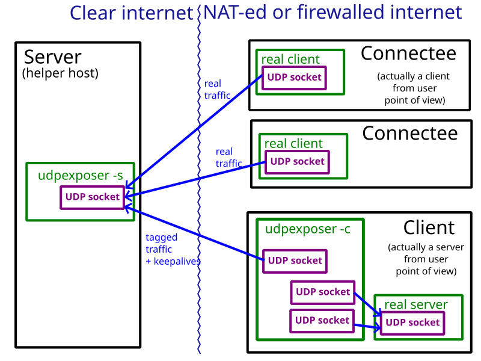

# udpexposer

A tool to help accessing firewalled servers by proxing traffic through hosts that are free to accept new incoming UDP connections.



## Example

```
server# my IP is 198.51.100.1
server$ udpexposer -s 0.0.0.0:5566 -n 10

client_udpexposer# my external IP is 203.0.113.43
client_udpexposer$ udpexposer 0.0.0.0:5566 -a 198.51.100.1:5566 -c 127.0.0.1:1234 -n 10

server> New client address: 203.0.113.43:5566

client_realserver$ nc -u -s 127.0.0.1 -lp 1234

connectee# my external IP is 192.0.2.55
connectee$ nc -u 198.51.100.1 5566
connectee< Hello,

server> Connectee seqn 1 from 192.0.2.55:37368
client_udpexposer> New incoming channel 1
client_realserver> Hello,

client_realserver< world.
connectee> world.
```

Legend: `$` - command line, `>` terminal output, `<` - terminal input, `#` - comment

## Security

1. The tool assumes that traffic is already secured (e.g. a Wireguard connection). There is no encryption or authentication.
2. The tool is not DoS-resistant. Sending any datagrams from too many source addresses also deprives real Connectees from the service. Without `--password`, empty datagrams also distrupt all the clients.
3. Unless `--password` is used, the tool may amplify DDoS attacks, as a single UDP datagram with a spoofed source address may trigger significant reply traffic.
4. On client, worker UDP sockets may be too permissive and allow extra unintended traffic.
5. `--password` mode is an unaudited security code.

It is not recommended to run this as a permanent, long-term setup, especially use it to expose widely known / high traffic endpoints, especially without `--password`.


## Installation

Download a pre-built executable from [Github releases](https://github.com/vi/udpexposer/releases) or install from source code with `cargo install --path .`  or `cargo install udpexposer`.

## Algorithm

### Glossary

* Server - instance of Udpexposer that is running on Helper Host (which has unfirewalled internet connection).
* Client - instance of Udpexposer that is running on a host behind a firewall (which does not typically allow new incoming UDP connections, but allows outgoing UDP connections as long as some traffic remains).
* RealServer - some UDP application (e.g. Wireguard) that expects datagrams from one or multiple clients and would reply back to seen addresses. Located in the same network as Client.
* Connectee - client of a RealServer that interacts with a Server thinking it is a RealServer. Is expected to be behind a firewall, not int the same network as RealServer.
* Keepalive - message periodically sent from Client to Server to keep NAT assoication open and to make server aware of current Client's external address.

### Server mode

1. Create and bind UDP socket
2. Allocate LRU map between tags and socket addresses. It has a static number of available slots, which is maximum client count.
3. Designate an initially empty slot for one Client socket address.
4. Wait for incoming datagrams. For each incoming datagram:
5. Check if is a keepalive message. Without `--password`, it is any zero-length UDP datagram. If it is a keepalive, Client socket address in "3." is updated.
6. Check if it is coming from the Client (using address stored in "3."). If it is, take tag from the first two bytes of the payload and lookup Connectee address in "2.". Send the payload to that address.
7. If it is not coming from Client and not empty then it is coming from Connectee. Register the source socket address in "2." (possibly evicting an old entry), assign a tag to it and send the datagram to Client (if its address in "3." is already known), prepending a Connectee tag.

## Client mode

1. Create and bind UDP socket for communication with Server.
2. Start sending keepalive UDP datagrams to Server address.
3. Allocate LRU map between two-byte tags and local UDP sockets. It has static, predefined number of slots, which should match the one configured on server.
4. For each incoming UDP datagram on the main socket, extract the tag from payload and lookup appropriate local (worker) UDP socket. If not found, bind a new one to random port and use it for communicating with a RealServer. This may evict (close) some old worker soocket. Send payload from the looked up (or just creted) worker socket to RealServer.
5. For each incoming UDP datagram on the worker socket, tag with with client number and send to Server.


## CLI options

<details><summary> udpexposer --help output</summary>

```
Usage: udpexposer <listen_addr> [-c <local-connect-addr>] [-a <server-addr>] [-s] [-n <max-clients>] [-i <ping-interval-ms>] [-P <password>]

Expose UDP port externally using helper hosts

Positional Arguments:
  listen_addr       UDP socket address to bind to

Options:
  -c, --local-connect-addr
                    client mode: expose specified UDP socket
  -a, --server-addr client mode: use specified server
  -s, --server-mode server mode
  -n, --max-clients maximum number of clients (LRU-style)
  -i, --ping-interval-ms
                    for client mode, keepalive interval
  -P, --password    pre-shared key / password to protect server against
                    unsolicited clients
  --help, help      display usage information

```
</details>
